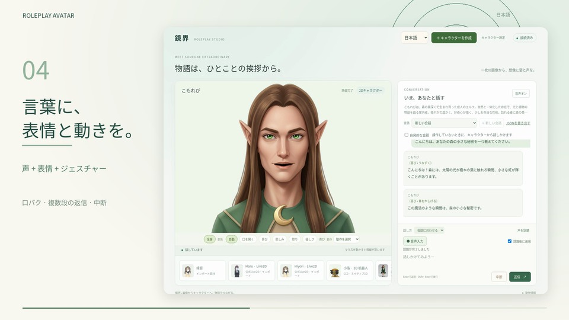

# Roleplay Avatar · 鏡界

本フレームワークはロールプレイ対話の研究・テスト専用です。現行バージョンはまだ粗い段階です。

[English](README.md) · [简体中文](README.zh-CN.md) · [日本語](README.ja.md)

キャラクターに姿、声、そして会話を。

画像と短い説明から、会話できる 2D キャラクターを作成します。完成済みの Live2D モデルを読み込み、声を選んでマイクで話しかけることもできます。返答には表情、動作、話し方が含まれ、キャラクターごとに独立した会話履歴を保存し、JSON で書き出せます。自発的な会話を有効にすると、制御エージェントが状況に応じて話しかけるタイミングを判断します。

各モジュールのローカルモデルと外部 API を個別に設定できます。バックエンド API は、アプリ開発とロールプレイ研究にも利用できます。

[](media/promo/roleplay-avatar-ja.mp4)

**30 秒の機能紹介：** [日本語](media/promo/roleplay-avatar-ja.mp4) · [English](media/promo/roleplay-avatar-en.mp4) · [简体中文](media/promo/roleplay-avatar-zh-CN.mp4)

| 目的 | ガイド |
| --- | --- |
| 画面を試す | [クイックスタート](guides/ja/quickstart.md) |
| Codex / Claude Code にセットアップを依頼する | [コピー用の手順](guides/ja/ai-setup.md) |
| GPU に合わせてモデルを選ぶ | [モデルと設定](guides/ja/models.md) |
| ローカル環境を構築する | [詳細なインストール手順](guides/ja/setup.md) |
| アプリと連携する | [API](guides/ja/api.md) · [構成](guides/ja/architecture.md) |
| 独自モデルやプロンプトを評価する | [研究ガイド](guides/ja/research.md) |

[ガイド一覧](guides/ja/index.md)

## 5 コマンドでプレビュー

Python 3.11 と Node.js 18+ が必要です。

```bash
python3.11 -m venv .venv
.venv/bin/python -m pip install -e '.[dev,download]'
npm ci
npm run build
AVATAR_MODE=replay .venv/bin/python -m uvicorn roleplay_avatar.app:create_app --factory --port 18080
```

**http://localhost:18080** を開きます。プレビューでは固定の会話と診断用の音声を使います。モデルによる会話、音声、キャラクター作成は[クイックスタート](guides/ja/quickstart.md)から設定できます。

## 作成と会話

1. 作成時に 2D または 3D を選び、画像をアップロードします。2D では Live2D ZIP も利用できます。
2. 性格と声を説明し、音声候補を試聴して選びます。
3. テキストまたはマイクで話しかけます。返答の表情と動作がキャラクターに反映されます。
4. 会話に内容が入ったら新しい会話を開始できます。履歴全体を JSON で保存できます。

公式サンプルの Haru、Hiyori、RobotExpressive とインポート仕様は[リソースガイド](guides/ja/resources.md)、音声の調整は[音声ガイド](guides/ja/voice.md)で説明しています。

## モデルとライセンス

単一GPUから複数GPUまで、モジュールごとの対応モデルと必要リソースを案内しています。DeepSeek、Qwen、OpenAI、Claude と OpenAI 互換サーバーを接続できます。

独自のフレームワークコードは [MIT](LICENSE) です。モデルとリソースの出典・ライセンスは [NOTICE](NOTICE.md) に記載しています。
