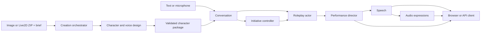

# Architecture and extension points

[English](architecture.md) · [简体中文](zh-CN/architecture.md) · [日本語](ja/architecture.md)

The application is a set of bounded agents and inference services coordinated by a CPU backend. Models produce text, plans or performance intent. Application code owns durable jobs, character publication, conversation state and playback.

## Modules

| Module | Technology | Input → output / extension |
| --- | --- | --- |
| Creation orchestration | FastAPI, durable stage records, GPUQ/local worker | Image/ZIP + brief → validated package; `creation.py`, `native_import.py` |
| Visual character design | Transformers image-text model or vision API | Image + description → observations, persona, image prompt, voice brief; `plan_character.py` |
| Text character design agent | ModelGateway + Pydantic | Imported resource brief → `CharacterDesign`; `design.py` |
| 2D generation/binding | FLUX or Qwen Image, BiRefNet, MediaPipe, source-lip deformation | Illustration → foreground, face rig, continuous lip mesh; `build_puppet.py`, `bind_source_mouth.py` |
| Optional 3D generation | AniGen, DINOv2, DSINE, mesh processing | Image → GLB, skeleton, skinning, facial targets; `generate_mesh.py` |
| Voice design | Qwen3-TTS VoiceDesign | Persona/voice prompt → candidate audio, transcript, seed, hash; `character_voices.py` |
| Roleplay agent | Replaceable local/API LLM | Persona + conversation → performance JSON or actor text; `live.py` |
| Performance director | Shared or separate LLM | Actor text → speech, emotion, bounded gestures and delivery |
| Initiative controller | Presence/cooldown rules + LLM | Idle context → decision, topic, single-use ticket; `initiative.py` |
| Voice direction | `Delivery` schema + synthesis mapping | Utterance/intent → tone, pace, pause; `voice_direction.py` |
| Speech | CosyVoice3 streaming; alternative family adapters | Text + character reference → 24 kHz PCM16 |
| Audio expressions | UniTalker ONNX + semantic emotion | Speech → facial coefficients; `performance.py` |
| Speech input | Whisper family | 16 kHz PCM16 → user text; `speech_input.py` |
| Conversations/transport | JSON persistence, HTTP NDJSON, WebSocket | Isolated histories, export, cancellation; `conversations.py`, `backend.py`, `session.py` |
| Rendering | WebGL 2D, PixiJS/Cubism, Babylon.js; Canvas CPU preview | Audio-clock events → mouth, expressions, gestures; `web/` |

## Agent interface

`ModelGateway(role).stream(system, messages, max_tokens=..., temperature=...)` yields text deltas. `structured(system, data, schema, max_tokens=...)` returns a Pydantic-validated object. The gateway centralizes provider routing, authentication, SSE parsing and request cancellation. `/api/agents` lists roles and selected models.

The actor can emit `Segment` objects directly, or use `output_mode: "actor_director"`. In the latter mode, the specialized roleplay model generates natural dialogue and stage directions; a separate director translates that result into the rendering contract. Its extra model call adds latency, so applications can choose the direct mode when their actor reliably emits structured output.

A segment includes `text`, `emotion`, `intensity`, `action_intent`, `actions` and `delivery`. Supported gestures are `nod`, `shake_head`, `tilt`, `bow`, `lean_forward`, `lean_back`, `sway` and `bounce`. Bounds are validated before playback. Native Live2D also has model-authored motions and physics. The voice-direction API is available independently; the default turn path already receives delivery from the actor/director.

## Inference contracts

| Service | Request | Result |
| --- | --- | --- |
| Local LLM `/chat` | `persona`, `messages`, generation settings | NDJSON `{ "text": "delta" }` |
| TTS `/speak` | Character ID, text, emotion and delivery | Contiguous `sample_offset`, `sample_count`, 24 kHz mono PCM16 base64, then `done` + `total_samples` |
| ASR `/transcribe` | `pcm_base64`, `sample_rate=16000` | `text`, duration and inference metadata |
| Audio-to-face | PCM blocks with temporal context | Defined channel coefficients; see `performance.py` and `services/audio_face_service.py` |
| Creation stage | Durable request and preceding outputs | Stage-specific files, followed by eight-file package validation |

New services keep these boundaries or supply an adapter in `live.py`, `speech_input.py` or `performance.py`. Inference dependencies stay in service-specific environments.

## State and timing

Character creation saves each completed stage and publishes the final package atomically. Image-based 2D creation automatically completes source-lip binding before publication. Native imports retain their original mesh and parameter mapping. A character declares one presentation type.

Each turn has a unique `turn_id`. Audio, face and motion use the cumulative `sample_offset`; paragraph pauses advance that same clock. Cancellation closes the model request and stops scheduled browser audio. Sentence-buffered speech adapters release their inference lock after the current native call finishes.

Initiative starts disabled. Visibility, typing, recording, playback, idle time, active reply and cooldown gates run before the LLM. Approved decisions carry a single-use 45-second ticket bound to the conversation version. One unanswered proactive turn waits for a user response.

The character library is shared by a deployment. Conversations are isolated by client and character. The reference storage and cancellation table use one web worker; a scaled deployment can replace them with a transactional database and shared job registry.

## Directory responsibilities

`src/` contains the backend and contracts; `services/` executes models and prepares assets; `web/` provides UI and rendering; `scripts/` installs, validates and operates the system; `configs/` holds examples and upstream locks; `requirements/` defines service dependencies; `schemas/` publishes contracts; `fixtures/` provides replay and test inputs; `guides/` contains public tutorials; `media/promo/` contains finished videos; `licenses/` retains component notices. Runtime data is stored in `characters/`, `outputs/` and `third_party/`.

[← All guides](index.md)
