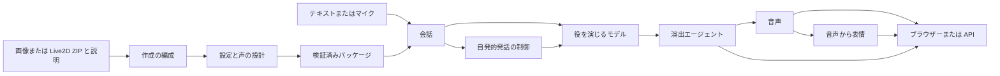

# 構成と拡張点

[English](../architecture.md) · [简体中文](../zh-CN/architecture.md) · [日本語](architecture.md)

CPU バックエンドが、役割を限定したエージェントと推論サービスを調整します。モデルはテキスト、計画、演技意図を出力し、アプリがジョブ、キャラクター公開、会話状態、再生を管理します。

## モジュール

| モジュール | 技術 | 入出力と実装 |
| --- | --- | --- |
| 作成の編成 | FastAPI、永続的な段階記録、GPUQ/ローカルワーカー | 画像/ZIP と説明 → パッケージ。`creation.py`、`native_import.py` |
| 視覚を使う設定設計 | Transformers 画像テキストモデル、視覚 API | 画像と説明 → 観察、設定、画像・音声プロンプト |
| テキストから設定設計 | ModelGateway、Pydantic | 説明 → `CharacterDesign`。`design.py` |
| 2D 生成とリギング | FLUX/Qwen Image、BiRefNet、MediaPipe、元の唇の変形 | 立ち絵 → 前景、顔のリグ、連続的な口のメッシュ |
| 任意の 3D | AniGen、DINOv2、DSINE、メッシュ処理 | 画像 → GLB、骨格、スキニング、顔モーフ |
| 声の設計 | Qwen3-TTS VoiceDesign | 設定と声の指定 → 音声候補、台詞、シード、ハッシュ |
| ロールプレイ | 差し替え可能なローカル/API LLM | 設定と会話 → 演技 JSON または自然な返答 |
| 演出 | 共通または別の LLM | 返答 → 台詞、感情、範囲を限定した動作、話し方 |
| 自発的発話 | 状態・待機規則と LLM | 文脈 → 判定、話題、一度限りのチケット |
| 音声演出 | `Delivery` スキーマ、合成パラメータ | 台詞と意図 → 調子、速度、休止 |
| 音声合成 | CosyVoice3 ストリーミング、系列アダプター | テキストと参照音声 → 24 kHz PCM16 |
| 音声から表情 | UniTalker ONNX、意味上の感情 | 音声 → 顔の係数 |
| マイク入力 | Whisper 系列 | 16 kHz PCM16 → テキスト |
| 会話と転送 | JSON、HTTP NDJSON、WebSocket | 独立履歴、書き出し、中断 |
| 描画 | WebGL 2D、PixiJS/Cubism、Babylon.js、Canvas プレビュー | 音声時刻のイベント → 口、表情、動作 |

## エージェントのインターフェース

`ModelGateway(role).stream(system, messages, max_tokens=..., temperature=...)` はテキスト差分を返し、`structured(system, data, schema, max_tokens=...)` は Pydantic 検証済みオブジェクトを返します。ゲートウェイがルーティング、認証、SSE 解析、中断を管理します。`/api/agents` で役割とモデルを確認できます。

モデルは `Segment` を直接生成するか、`actor_director` を使います。後者は追加の呼び出しで自然な返答を描画契約に変換します。構造化出力が安定するモデルでは直接モードを選べます。

セグメントには `text`、`emotion`、`intensity`、`action_intent`、`actions`、`delivery` を含みます。動作は `nod`、`shake_head`、`tilt`、`bow`、`lean_forward`、`lean_back`、`sway`、`bounce` です。再生前に範囲を検証します。Live2D ではモデル固有の動作と物理も使えます。音声演出 API は単独でも利用でき、既定の会話は役・演出モデルから `delivery` を受け取ります。

## 推論契約

| サービス | 入力 | 出力 |
| --- | --- | --- |
| ローカル LLM `/chat` | `persona`、`messages`、生成設定 | NDJSON `{"text":"delta"}` |
| TTS `/speak` | キャラクター ID、台詞、感情、話し方 | 連続した `sample_offset`、`sample_count`、24 kHz モノラル PCM16 base64。最後に `done` と `total_samples` |
| ASR `/transcribe` | `pcm_base64`、`sample_rate=16000` | テキスト、時間、推論情報 |
| 音声表情 | 時間文脈を持つ PCM ブロック | 規定チャンネルの係数 |
| 作成段階 | 永続リクエストと前段の成果 | 段階別ファイル、八ファイル契約の検証 |

新サービスはこの境界を維持するか、`live.py`、`speech_input.py`、`performance.py` にアダプターを追加します。推論依存は専用環境に置きます。

## 状態と同期

作成では各段階を保存し、最終パッケージを原子的に公開します。新しい 2D 立ち絵は元の唇を使うリギングを完了してから公開します。Live2D は元のメッシュを保持します。表示形式は一つです。

ターンは一意な `turn_id` を持ちます。音声、表情、動作は累積 `sample_offset` を使い、段落の休止も進めます。中断でモデルへの接続を閉じ、ブラウザーの予約済み音声を停止します。一文単位のアダプターはネイティブ呼び出し完了後にロックを解放します。

自発的発話は既定でオフです。表示状態、入力、録音、再生、待機時間、実行中の返信、クールダウンを先に確認し、LLM に判定を求めます。チケットは会話バージョンに紐付き、45 秒間、一度だけ使えます。未回答の自発的発話があればユーザーを待ちます。

キャラクターライブラリはデプロイ内で共有し、会話はクライアントとキャラクターで分離します。参照実装は単一 Web worker を使います。拡張時はトランザクション対応 DB と共有ジョブ管理に交換できます。

## ディレクトリ

`src/` はバックエンドと契約、`services/` は推論と素材処理、`web/` は画面と描画、`scripts/` はインストール・検証・運用、`configs/` は設定例と固定リビジョン、`requirements/` は依存、`schemas/` は契約、`fixtures/` はテスト入力、`guides/` は公開ガイド、`media/promo/` は完成動画、`licenses/` はライセンスです。実行データは `characters/`、`outputs/`、`third_party/` に保存します。

[← ガイド一覧](index.md)
