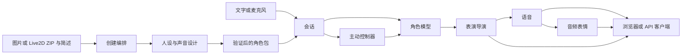

# 系统架构与扩展点

[English](../architecture.md) · [简体中文](architecture.md) · [日本語](../ja/architecture.md)

CPU 后端协调职责明确的智能体和推理服务。模型产生文本、方案和表演意图；应用负责持久任务、角色发布、会话状态和播放。

## 模块

| 模块 | 技术 | 输入、输出与实现 |
| --- | --- | --- |
| 创建编排 | FastAPI、持久阶段记录、GPUQ/本地工作进程 | 图片/ZIP 与简述 → 角色包；`creation.py`、`native_import.py` |
| 视觉人设 | Transformers 图文模型或视觉 API | 图片、描述 → 观察、人设、绘图与声音提示；`plan_character.py` |
| 文字人设智能体 | ModelGateway、Pydantic | 导入素材的简述 → `CharacterDesign`；`design.py` |
| 2D 生成与绑定 | FLUX/Qwen Image、BiRefNet、MediaPipe、原图嘴部形变 | 立绘 → 前景、脸部绑定、连续嘴部网格 |
| 可选 3D | AniGen、DINOv2、DSINE、网格处理 | 图片 → GLB、骨骼、蒙皮、面部目标 |
| 声线设计 | Qwen3-TTS VoiceDesign | 人设与声音提示 → 带文本、种子和哈希的音频候选 |
| 角色扮演 | 可替换本地/API LLM | 人设与会话 → 表演 JSON 或角色文本；`live.py` |
| 表演导演 | 共用或独立 LLM | 角色回复 → 台词、情绪、有限动作、语调 |
| 主动控制 | 状态/冷却规则与 LLM | 空闲上下文 → 判断、话题、一次性票据；`initiative.py` |
| 语音导演 | `Delivery` 契约、合成参数映射 | 台词与意图 → 语调、语速、停顿 |
| 语音合成 | CosyVoice3 流式与系列适配器 | 文本、参考声音 → 24 kHz PCM16 |
| 音频表情 | UniTalker ONNX、语义情绪 | 语音 → 面部系数；`performance.py` |
| 麦克风输入 | Whisper 系列 | 16 kHz PCM16 → 文本 |
| 会话与传输 | JSON、HTTP NDJSON、WebSocket | 独立历史、导出、中断 |
| 渲染 | WebGL 2D、PixiJS/Cubism、Babylon.js、Canvas CPU 预览 | 音频时钟事件 → 口型、表情、动作 |

## 智能体接口

`ModelGateway(role).stream(system, messages, max_tokens=..., temperature=...)` 输出文本增量；`structured(system, data, schema, max_tokens=...)` 返回 Pydantic 验证对象。网关负责供应商路由、认证、SSE 解析、取消。`/api/agents` 列出角色与模型。

角色模型可直接输出 `Segment`，也可使用 `actor_director`。后者增加一次模型调用，将自然角色文本转为绘制契约；模型能稳定输出结构时可选直接模式。

段落包括 `text`、`emotion`、`intensity`、`action_intent`、`actions`、`delivery`。动作支持 `nod`、`shake_head`、`tilt`、`bow`、`lean_forward`、`lean_back`、`sway`、`bounce`，播放前验证范围。Live2D 还可使用原生动作和物理。语音导演 API 可单独调用；默认对话已从角色/导演取得 `delivery`。

## 推理契约

| 服务 | 输入 | 输出 |
| --- | --- | --- |
| 本地 LLM `/chat` | `persona`、`messages`、生成参数 | NDJSON `{"text":"delta"}` |
| TTS `/speak` | 角色 ID、文本、情绪、语调 | 连续 `sample_offset`、`sample_count`、24 kHz 单声道 PCM16 base64，最后 `done`、`total_samples` |
| ASR `/transcribe` | `pcm_base64`、`sample_rate=16000` | 文本、时长、推理信息 |
| 音频表情 | 含时间上下文的 PCM | 规定通道的系数 |
| 创建阶段 | 持久请求和前序结果 | 阶段文件、八文件角色验证 |

新增服务可保持这些边界，或在 `live.py`、`speech_input.py`、`performance.py` 中加适配器。模型依赖安装到各自环境。

## 状态与同步

每个创建阶段保存结果，最终角色包原子发布。新 2D 角色必须完成原图嘴部绑定，Live2D 导入保留原生网格。角色只声明一种展示类型。

每轮有唯一 `turn_id`。音频、面部、动作使用累计 `sample_offset`，段落停顿也推进此时钟。取消会关闭模型请求并停止浏览器排队音频；整句合成适配器在当前原生调用结束后释放推理锁。

主动模式默认关闭；可见性、输入、录音、播放、空闲、进行中的回复、冷却规则先于 LLM 判断。票据绑定会话版本，有效 45 秒、仅使用一次。一次主动发言未获回应时等待用户。

部署共享角色库，会话按客户端与角色隔离。参考存储和取消注册表使用单 Web worker；扩展部署可替换为事务数据库和共享任务注册表。

## 目录职责

`src/` 是后端和契约；`services/` 是模型执行与资产处理；`web/` 是界面与渲染；`scripts/` 是安装、验证和运维入口；`configs/` 是配置样例与上游锁；`requirements/` 是环境依赖；`schemas/` 是公开契约；`fixtures/` 是回放和测试输入；`guides/` 是公开教程；`media/promo/` 是成片；`licenses/` 保存组件许可。运行数据分别写入 `characters/`、`outputs/` 和 `third_party/`。

[← 全部指南](index.md)
